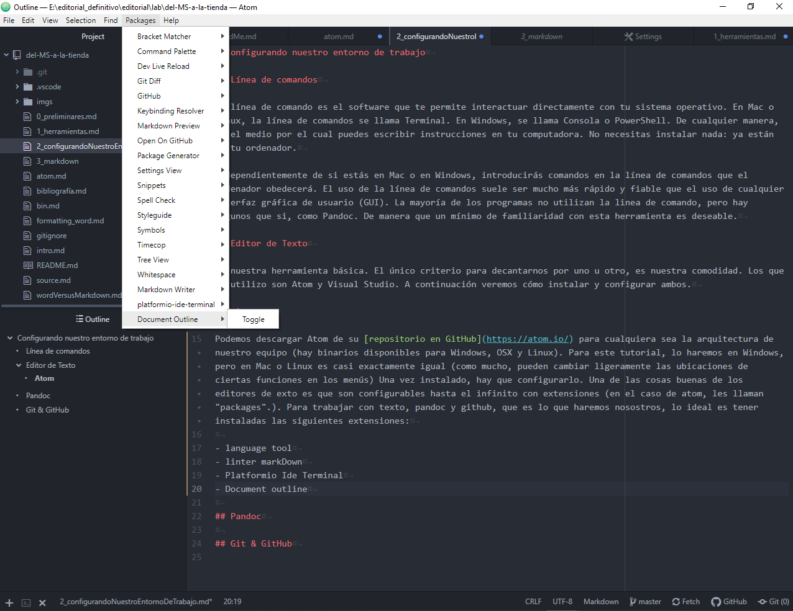

# Configurando nuestro entorno de trabajo

## Línea de comandos

La línea de comando es el software que te permite interactuar directamente con tu sistema operativo. En Mac o Linux, la línea de comandos se llama Terminal. En Windows, se llama Consola o PowerShell. De cualquier manera, es el medio por el cual puedes escribir instrucciones en tu computadora. No necesitas instalar nada: ya están en tu ordenador.

Independientemente de si estás en Mac o en Windows, introducirás comandos en la línea de comandos que el ordenador obedecerá. El uso de la línea de comandos suele ser mucho más rápido y fiable que el uso de cualquier interfaz gráfica de usuario (GUI). La mayoría de los programas no utilizan la línea de comando, pero hay algunos que si, como Pandoc. De manera que un mínimo de familiaridad con esta herramienta es deseable.

## Editor de Texto

Es nuestra herramienta básica. El único criterio para decantarnos por uno u otro, es nuestra comodidad. Los que yo utilizo son Atom y Visual Studio. A continuación veremos cómo instalar y configurar ambos.

### Atom

Podemos descargar Atom de su [repositorio en GitHub](https://atom.io/) para cualquiera sea la arquitectura de nuestro equipo (hay binarios disponibles para Windows, OSX y Linux). Para este tutorial, lo haremos en Windows, pero en Mac o Linux es casi exactamente igual (como mucho, pueden cambiar ligeramente las ubicaciones de ciertas funciones en los menús) Una vez instalado, hay que configurarlo. Una de las cosas buenas de los editores de texto es que son configurables hasta el infinito con extensiones (en el caso de atom, les llaman "packages".). Para trabajar con texto, pandoc y github, que es lo que haremos nosotros, lo ideal es tener instaladas las siguientes extensiones:

- language tool
- linter markDown
- Platformio Ide Terminal
- Document outline
- markdown Writer

## Pandoc

## Git & GitHub
