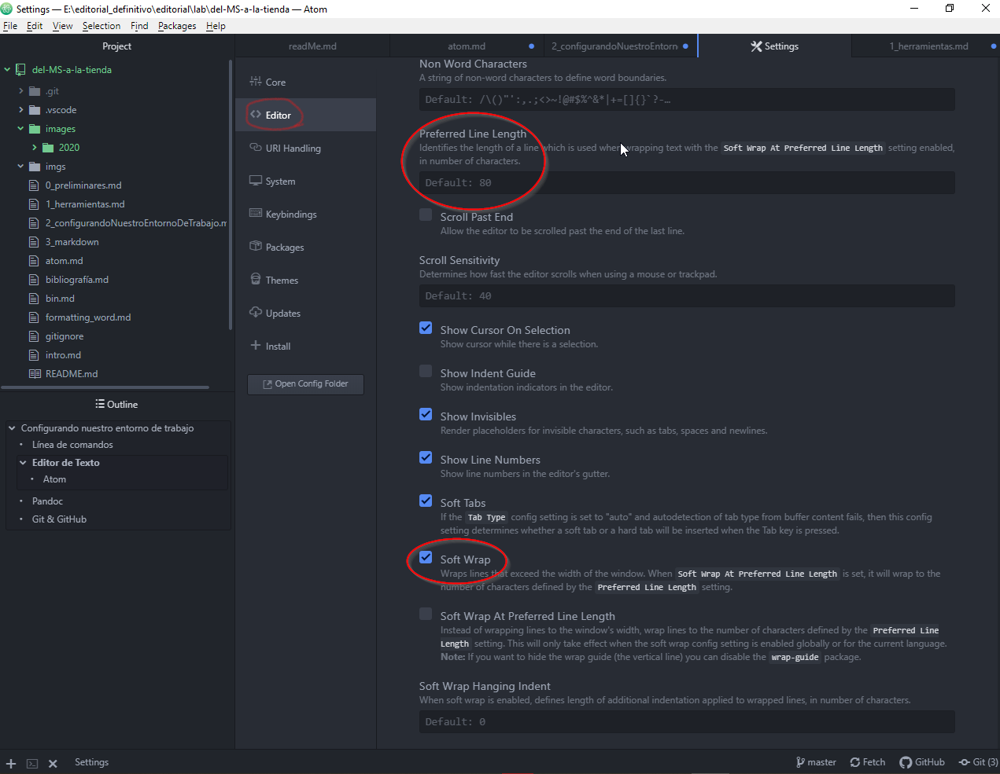
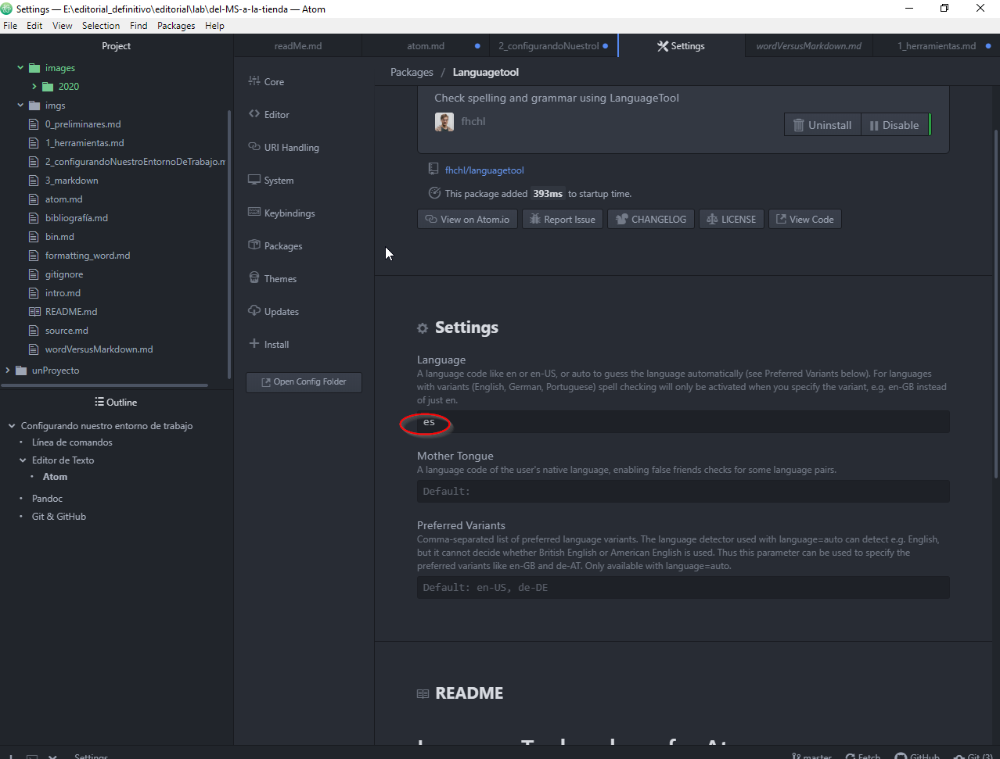
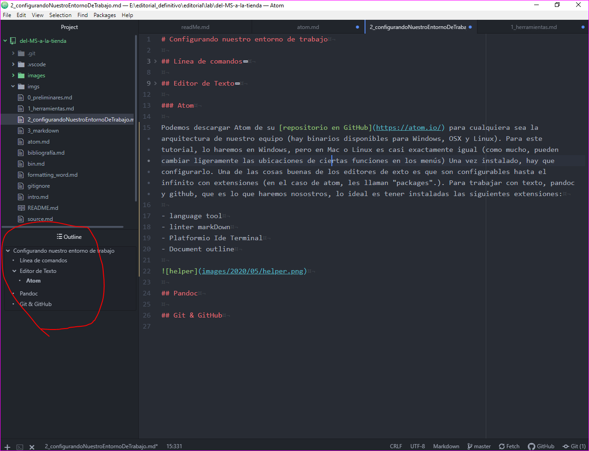
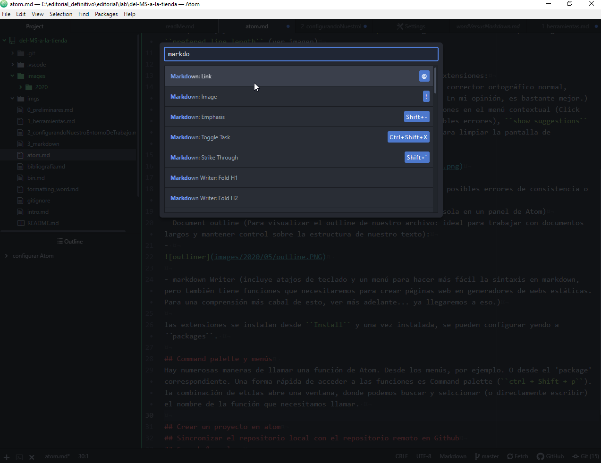
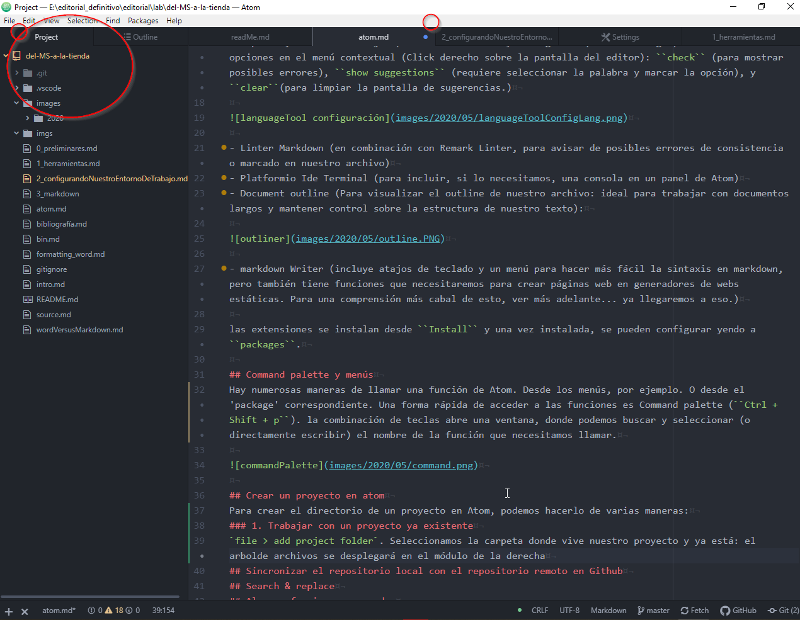

# configurar Atom

## Instalar atom
Podemos descargar Atom de su [repositorio en GitHub](https://atom.io/) para cualquiera sea la arquitectura de nuestro equipo (hay binarios disponibles para Windows, OSX y Linux).
## Overview: configurar el editor
Cuando abrimos Atom por primera vez, tenemos tres pantallas: la pantalla de bienvenida (que podemos cerrar y antes, marcar la casilla: no volver a mostrar), una invitación a colaborar (que también podemos cerrar) y el menú principal. Para trabajar con un entorno más limpio, yo prefiero cerrar todo y quedarme solamente con el archivo en blanco.
## Instalar paquetes básicos para editar y trabajar con  Markdown y Git
Atom es configurable hasta el hartazgo. Dependiendo de qué uso le vayamos a dar, podemos instalar una cantidad de extensiones (packages, en el lenguaje de Atom), que nos harán la vida muchísimo más fácil. Pero para comenzar, antes conviene establecer algunas elecciones básicas.
### 1. Configurar el editor:
Las preferencias de Atom están en el menú ``Packages > Settings view > open`` donde podemos acceder a una buena cantidad de opciones. A la izquierda tenemos un menú, donde se despliegan todas las opciones de configuración (Editor, core, packages, etc...). De momento, y para mayor comodidad a la hora de trabajar con texto, vamos a limitar el contenedor de texto.  Para esto iremos a ``editor`` en menú de la izquierda, y marcaremos en la casilla ``soft wrap``. La longitud de la casilla se puede regular en ``prefered line length`` (ver imagen)

### 2. Instalar extensiones necesarias:
Para los efectos de este tutorial vamos a instalar una batería de extensiones:
- Language Tool (corrector ortográfico, pero que a diferencia de un corre
-   ctor ortográfico normal, muestra errores gramaticales, a la manera del cor
-     rector de MS Word. En mi opinión, es bastante mejor.) Una vez instalado y configurado (mirar la imagen) tenemos tres opciones en el menú contextual (Click derecho sobre la pantalla del editor): ``check`` (para mostrar posibles errores), ``show suggestions`` (requiere seleccionar la palabra y marcar la opción), y ``clear``(para limpiar la pantalla de sugerencias.)

- Linter Markdown (en combinación con Remark Linter, para avisar de posibles errores de consistencia o marcado en nuestro archivo)
- Platformio Ide Terminal (para incluir, si lo necesitamos, una consola en un panel de Atom)
- Document outline (Para visualizar el outline de nuestro archivo: ideal para trabajar con documentos largos y mantener control sobre la estructura de nuestro texto):

- markdown Writer (incluye atajos de teclado y un menú para hacer más fácil la sintaxis en markdown, pero también tiene funciones que necesitaremos para crear páginas web en generadores de webs estáticas. Para una comprensión más cabal de esto, ver más adelante... ya llegaremos a eso.)

las extensiones se instalan desde ``Install`` y una vez instalada, se pueden configurar yendo a ``packages``.

## Command palette y menús
Hay numerosas maneras de llamar una función de Atom. Desde los menús, por ejemplo. O desde el 'package' correspondiente. Una forma rápida de acceder a las funciones es Command palette (``Ctrl + Shift + p``). la combinación de teclas abre una ventana, donde podemos buscar y seleccionar (o directamente escribir) el nombre de la función que necesitamos llamar.

## Crear un proyecto en atom
Para crear el directorio de un proyecto en Atom:

`file > add project folder`. Seleccionamos la carpeta donde vive nuestro proyecto y ya está: el arbol de archivos se desplegará en el módulo de la derecha (También podemos arrastrar un directorio directamente sobre el panel `Project`).

## Sincronizar el repositorio local con el repositorio remoto en Github
Una vez que tenemos nuestro proyecto en Atom, iniciaremos un repositorio Git para llevar el control de versiones (hablaremos más acerca de qué es Git más adelante).
## Search & replace
## Algunas funciones avanzadas
